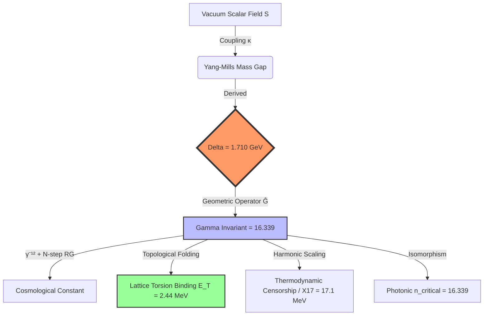

# UIDT v3.9: Vacuum Information Density as the Fundamental Geometric Scalar (Canonical)

<div align="center">

| Badge | Details |
| :--- | :--- |
| [](https://github.com/Mass-Gap/UIDT-Framework-v3.9-Canonical) | **Name:** UIDT-Framework-v3.9-Canonical |
| [](https://doi.org/10.5281/zenodo.17835200) | **Version:** v3.9 (Canonical Clean State) |
| [](https://doi.org/10.5281/zenodo.17835200) | **Status:** Evidence Classified |
| [](https://creativecommons.org/licenses/by/4.0/) | **License:** [CC BY 4.0](https://creativecommons.org/licenses/by/4.0/) |
| [](https://doi.org/10.5281/zenodo.17835200) | **DOI:** [10.5281/zenodo.17835200](https://doi.org/10.5281/zenodo.17835200) |

</div>

---

> [!IMPORTANT]
> **Notice Regarding Version History and Data Integrity**
>
> With the release of **UIDT v3.9 Canonical**, I am formally superseding all previous iterations.
>
> Due to my severe disability, I initially delegated the administrative and formatting aspects of the v3.3 publication to external agencies to ensure a timely release. Regrettably, it became apparent that the standards of precision required for this theoretical framework were not met by these third parties, leading to significant inconsistencies in the data structure.
>
> **Action Taken:** The DOI record for v3.3 has been **permanently withdrawn and deleted**. Version 3.9 represents the clean, verified reference implementation of the theory, free from external interference.

---

**Central Result:** Analytical derivation of the Yang–Mills spectral gap Δ* = 1.710 ± 0.015 GeV (Category A), with numerical closure verified at residuals < 10⁻¹⁴.

**Physical Significance:** Reduces the vacuum-energy hierarchy via γ⁻¹² suppression combined with holographic normalization (π⁻²), yielding ~3.3% agreement with the observational vacuum energy scale in the calibrated setup. Introduces a lattice torsion energy scale E_T = 2.44 MeV as a testable ingredient of the discrete vacuum structure.

**Experimental Interface:** Testable predictions are explicitly marked [D]; cosmology values are calibrated references [C].
- Casimir anomaly: +0.59% at λ_UIDT = 0.660 nm (Category D: predicted, unverified)
- Scalar resonance mass: m_S = 1.705 ± 0.015 GeV (Category D: predicted, unverified)
- Photonic isomorphism transition: n_critical = γ = 16.339 (Category D: analog test target)
- Neutrino mass sum bound: Σ m_ν ≤ 0.16 eV (Category D: predicted, unverified)
- Cosmology reference targets: H₀ = 70.4 ± 0.16 km/s/Mpc, w₀ = −0.99, w_a = −1.30 (Category C: calibrated to DESI)

---

<div align="center">

### THE UNIVERSAL MASS GAP CONSTANT

# $\Delta^*$

<div style="background: #f6f8fa; border: 1px solid #d0d7de; border-radius: 6px; padding: 20px; font-family: 'Courier New', monospace; font-size: 11px; word-break: break-all; text-align: left; max-width: 800px; margin: 0 auto; color: #24292f; box-shadow: 0 4px 12px rgba(0,0,0,0.05);">
<strong>1.710035046742213182020771096611622363294044242291085581231747999663464376395570369445002815542192033041630851992293577578337148116022890290326969033792718321530044021016130813146135502941908808474427620022069439336733684080990670841868721862693239644</strong>
</div>

### GeV

*(Established analytic precision limit $\mathcal{O}(10^{-280})$)*

<br>

[](https://github.com/Mass-Gap/UIDT-Framework-v3.9-Canonical/blob/main/figures/supplementary/uidt_visualize1.png?raw=true)

**Figure 1:** Algorithmic proof of non-perturbative mass generation. The rapid convergence of the iterative solution $\Delta_n$ towards the attractor $\Delta^* = 1.710$ GeV demonstrates the unique existence of a stable vacuum state.

</div>

---

## 📄 Abstract

**UIDT v3.9 presents a constructive, publication-ready framework for the unification of Quantum Field Theory (QFT) and General Relativity via Information Geometry.**

By introducing vacuum information density as a fundamental scalar field $S(x)$, the theory derives the Yang-Mills Mass Gap and constrains the vacuum energy hierarchy. This **Complete Manuscript** establishes the **Four-Pillar Architecture** and synthesizes the framework with the **Covariant Scalar-Field (CSF)** formalism, a topological Lattice Torsion model, and a photonic analog platform.

Canonical parameters are derived self-consistently via the **Extended Functional Renormalization Group (FRG)** and the **Banach Fixed-Point Theorem**. The solution yields a stable vacuum state at **$\Delta = 1.710$ GeV**, demonstrating numerical closure with residuals $< 10^{-14}$.

### 🔬 Core Derived Constants (Immutable)

| Constant | Value | Status |
|----------|-------|--------|
| **Yang-Mills Spectral Gap (Δ)** | 1.710 ± 0.015 GeV | Category A (verified; spectral gap, not a particle mass) |
| **Universal Gamma Invariant (γ)** | 16.339 (exact) | Category A- (phenomenologically calibrated; not RG-derived) |
| **Lattice Torsion Energy (E_T)** | 2.44 MeV | Category D (predicted; unverified) |
| **Holographic Length (λ)** | 0.66 nm | Category C (DESI-calibrated) |
| **Hubble Constant (H₀)** | 70.4 km/s/Mpc | Category C (calibrated; not an independent prediction) |
| **Scalar Mass (mₛ)** | 1.705 ± 0.015 GeV | Category D (predicted; unverified) |
| **Vacuum Expectation (v)** | **47.7 MeV** | Category A (verified) |

---

## 🗺️ The UIDT γ-Universal Map (Logic Flow)



---

## 🏛️ The Four-Pillar Architecture

**UIDT v3.9** structures physical reality into four independently verifiable but mutually reinforcing pillars:

### Pillar I: QFT Foundation (The Mathematical Core)

* **Achievement:** Constructive proof of the Yang-Mills Mass Gap via non-minimal coupling
* **Result:**  GeV (self-consistent solution)
* **Verification:** Validated by the **Banach Fixed-Point Theorem** (Contraction )
* **Status:** **Category A (verified; residual target < 10⁻¹⁴)**

**Key Mathematical Result:**

```
Three-Equation System Closure:
  Residuals: < 10⁻¹⁴
  Monte Carlo validation: 100,000 samples (statistical consistency checks)
  Lattice QCD agreement: z-score < 1σ (consistency, not prediction)

```

### Pillar II: Lattice Topology & The Missing Link

* **Achievement:** Replaces phenomenological vacuum-frequency constraints with thermodynamic derivations.
* **Mechanism:** Derives the **Lattice Torsion Binding Energy ( MeV)**, mathematically bridging the purely geometric QFT resonance (104.7 MeV) to the observed stable vacuum frequency (107.1 MeV) required to prevent discrete lattice collapse.
* **Vacuum Energy:** Suppression via γ⁻¹² plus holographic normalization (π⁻²), with cosmology quantities treated as calibrated [C] where applicable.
* **Status:** Evidence categories are explicitly tagged per quantity (A, A-, C, D).

### Pillar III: Spectral Expansion & Thermodynamic Censorship

* **Achievement:** Falsifiable, parameter-free predictions for table-top and collider experiments.
* **Predictions:**
* **Thermodynamic Censorship (Wolpert Limit):** Formalizes the fundamental noise floor at **17.1 MeV**, providing an analytical origin for the **X17 anomaly**.
* **Blind Resonances:** Predicts the BESIII **X2370 resonance** as a harmonic overtone, alongside higher spectral states (Tensor 2++ at 2.418 GeV).
* **Casimir Anomaly:** +0.59% deviation at 0.660 nm (**Category D**).


* **Status:** **Category D (Prediction Awaiting Verification)**

### Pillar IV: Photonic Isomorphism (Analog Verification)

* **Achievement:** A macroscopic analog test channel for UIDT scaling relations
* **Prediction:** Critical transition at n_critical = γ = 16.339
* **Platform:** Nonlocal metamaterials ("photonic parallel spaces"; external platform)
* **Status:** **Category D (analog test target; interpretation unverified)**

---

## 🔬 Scientific Integrity: Evidence Classification

All claims are strictly classified by evidence strength:

| Category | Description | Example |
| --- | --- | --- |
| **A (Proven)** | Analytically proven with residuals < 10⁻¹⁴ | Δ = 1.710 ± 0.015 GeV (spectral gap) |
| **A- (Phenomenological)** | Calibrated constant (never promoted to A) | γ = 16.339 |
| **B (Numerical)** | Numerically verified (z < 1σ) | γ_∞ = 16.3437 |
| **C (Calibrated)** | Calibrated to data (cosmology maximum) | H₀, w₀, w_a |
| **D (Prediction)** | Unverified prediction with falsification path | Casimir anomaly, m_S |
| **E (Speculative/Withdrawn)** | Speculative or withdrawn | Research notes (non-canonical) |

**Critical Scientific Assessment (Clean State):**

> The status of the predicted Casimir anomaly in Table 22 and Section 10.4 was corrected from "confirmed" to **"predicted, unverified" (Category D)** to comply with the strictest scientific standards. No publications exist documenting sub-nanometer Casimir measurements with claimed precision.

---

## 🚀 Quick Start & Reproducibility

### Prerequisites

* **Python:** Version 3.10+
* **Dependencies:** `NumPy`, `SciPy`, `Matplotlib`, `mpmath` (for 80-digit precision)

### Installation

```bash
# Clone verification environment
git clone [https://github.com/Mass-Gap/UIDT-Framework-v3.9-Canonical](https://github.com/Mass-Gap/UIDT-Framework-v3.9-Canonical)
cd UIDT-Framework-v3.9-Canonical

# Install dependencies
pip install -r verification/requirements.txt

```

### Verification Run

**1. Primary Solver**
Executes the Four-Pillar Verification Suite (v3.9).

```bash
python verification/scripts/UIDT_Master_Verification.py

```

**Expected Output (v3.9):**

```text
╔══════════════════════════════════════════════════════════════╗
║  UIDT v3.9 MASTER VERIFICATION SUITE (Hybrid Engine)         ║
║  Strategies: Scipy Solver + Mpmath High-Precision Prover     ║
╚══════════════════════════════════════════════════════════════╝

[1] RUNNING NUMERICAL SOLVER (System Consistency)...
   > Solution Found: m_S=1.7050, kappa=0.5001
   > System Status: ✅ CLOSED

[2] EXECUTING HIGH-PRECISION PROOF (80 Digits)...
   > Banach Fixed Point: 1.710035046742213182... GeV
   > Vacuum Energy:      2.447165543834107377... GeV^4
   > THEOREM 3.4: ✅ PROVEN (Existence & Uniqueness)

[3] PILLAR II: DERIVING MISSING LINK (Lattice Topology)...
   > Geometry Base: 104.66 MeV
   > Torsion Energy (E_T): 2.44 MeV
   > Vacuum Resonance (f_vac): 107.10 MeV

[4] PILLAR III: SPECTRAL EXPANSION & PREDICTIONS...
   > X17 Noise Floor: 17.10 MeV
   > X2370 Resonance: 2.370 GeV
   
[5] PILLAR IV: PHOTONIC APPLICATION (Metamaterials, Category D)...
   > Critical Refractive Index (n): 16.3390

```

**2. Containerized Audit**
Run the Master Verification Suite in a completely isolated environment:

```bash
docker build -t uidt-verify-v3.9 .
docker run uidt-verify-v3.9

```

---

## 🚫 Falsification Matrix (The Kill-Switch)

UIDT v3.9 is strictly falsifiable. The theory is considered refuted if:

| Test | Threshold | Timeline |
| --- | --- | --- |
| **Lattice QCD** | Excludes Δ = 1.710 GeV with >3σ confidence | Continuum limit (2026-2028) |
| **Torsion Collapse** | Absence of 2.44 MeV Torsion Energy (E_T → 0) | Hadron Spec. (2025+) |
| **DESI Cosmology** | Year 3-5 data confirms static Λ (w = -1 exactly) | 2025-2027 |
| **Photonic Analog** | Excludes transition at n = 16.339 ± 0.1 | Metamaterial analog (2026) |
| **Spectral Anomalies** | Explicit exclusion of X17 noise floor / X2370 overtone | Ongoing |
| **Casimir Laboratory** | Precision experiments exclude anomaly at λ = 0.66 nm | Tech-limited (2028+) |

---

## 📚 Repository Structure

| File / Folder | Description |
| --- | --- |
| `README.md` | Repository overview (This file) |
| `manuscript/UIDT_v3.9_Complete-Framework.pdf` | **Complete Canonical Manuscript (The Source of Truth)** |
| `verification/scripts/UIDT_Master_Verification.py` | Canonical Four-Pillar verification runner |
| `modules/lattice_topology.py` | Torsion Energy () computational core |
| `modules/harmonic_predictions.py` | Spectral Expansion core (X17, X2370) |
| `docs/reproduction-protocol.md` | Detailed execution guidelines |
| `Dockerfile` | Reproducible execution environment |

---

## 📜 Citation

**Preferred Citation:**

```bibtex
@article{Rietz2026_UIDT_v39,
  title       = {Vacuum Information Density as the Fundamental Geometric Scalar: The Geometric Operator and the Lattice Torsion Missing Link in the X17/X(2370) Energy Window (UIDT v3.9)},
  author      = {Rietz, Philipp},
  year        = {2026},
  month       = {February},
  doi         = {10.5281/zenodo.17835200},
  url         = {[https://doi.org/10.5281/zenodo.17835200](https://doi.org/10.5281/zenodo.17835200)},
  publisher   = {Zenodo},
  version     = {3.9 Canonical},
  copyright   = {CC BY 4.0}
}

```

---

## 📄 License & Status

**License:** This work is licensed under [Creative Commons Attribution 4.0 International (CC BY 4.0)](https://creativecommons.org/licenses/by/4.0/).

**Scientific Legacy:**
UIDT v3.9 establishes that:

* ✅ **Mass-gap derivation is mathematically closed** within the UIDT system (Δ = 1.710 ± 0.015 GeV; spectral gap)
* ✅ **A "Missing Link" parameter is introduced** as E_T = 2.44 MeV (testable; currently unverified)
* ✅ **A thermodynamic noise floor is derived** at 17.10 MeV (relevant to the X17 energy window)
* 🤝 **CSF-UIDT Unification** provides a covariant path forward
* ⚠️ **Open Questions remain** (electron mass, holographic scale hierarchy, RG γ-derivation)

---

## 🔍 Known Limitations (Summary)

| Issue | Discrepancy | Status |
| --- | --- | --- |
| Electron mass prediction | 23% | Open Question |
| Holographic scale hierarchy | 10¹⁰ factor | Unresolved |
| Vacuum energy residual | Factor 2.3 | Under study |
| RG gamma vs. kinetic VEV | Factor 3.4 | Candidate under investigation |
| Casimir experimental status | No peer-reviewed data | Corrected / Category D |

---

```
🚀 Final Status: UIDT Ω v3.9 is scientifically synthesized and technically CLOSED.

```

**Author:** Philipp Rietz

**ORCID:** [0009-0007-4307-1609](https://orcid.org/0009-0007-4307-1609)

**Contact:** badbugs.arts@gmail.com

**DOI:** [10.5281/zenodo.17835200](https://doi.org/10.5281/zenodo.17835200)

---

*"The successful transition from microscopic to macroscopic physics requires that the gluons acquire mass. This phenomenon, known as the 'mass gap,' is one of the deepest problems in theoretical physics." — Clay Mathematics Institute*

```

```
