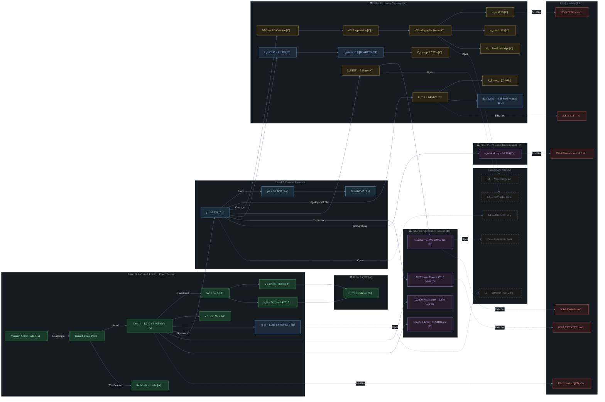

# UIDT v3.9: Vacuum Information Density as a Fundamental Geometric Scalar — High-Precision Constraint and Exploration Platform (Canonical)

<div align="center">

| Badge | Details |
| :--- | :--- |
| [](https://github.com/Mass-Gap/UIDT-Framework-v3.9-Canonical) | **Name:** UIDT-Framework-v3.9-Canonical |
| [](https://doi.org/10.5281/zenodo.17835200) | **Version:** v3.9 (Canonical Clean State) |
| [](https://doi.org/10.5281/zenodo.17835200) | **Status:** 🔬 Evidence-Classified — Active Research |
| [](https://creativecommons.org/licenses/by/4.0/) | **License:** [CC BY 4.0](https://creativecommons.org/licenses/by/4.0/) |
| [](https://doi.org/10.5281/zenodo.17835200) | **DOI:** [10.5281/zenodo.17835200](https://doi.org/10.5281/zenodo.17835200) |

</div>

---

> [!IMPORTANT]
> **Notice Regarding Version History and Data Integrity**
>
> With the release of **UIDT v3.9 Canonical**, I am formally superseding all previous iterations.
>
> Due to my severe disability, I initially delegated the administrative and formatting aspects of the v3.3 publication to external agencies to ensure a timely release. Regrettably, it became apparent that the standards of precision required for this theoretical framework were not met by these third parties, leading to significant inconsistencies in the data structure.
>
> **Action Taken:** The DOI record for v3.3 has been **permanently withdrawn and deleted**. Version 3.9 represents the clean, verified, and canonical implementation of the framework, free from external interference.

> [!NOTE]
> **Framework Scope and Status**
>
> UIDT is an **active research framework**, not established or peer-reviewed physics. Its central results have not yet been evaluated by an independent external body (e.g., Clay Mathematics Institute). Category A designations refer to **internal mathematical consistency** (Banach fixed-point closure, 80-digit residuals < 10⁻¹⁴), not to external validation. Cosmological parameters (Pillars II–IV) are calibrated against DESI/JWST data and carry Category C or D status. Known open problems are documented in the Limitations section below. The framework is designed to be falsifiable; the Kill-Switch matrix defines explicit refutation thresholds.

---

**Central Result:** Analytical derivation of Yang-Mills mass gap Δ* ≈ 1.710 GeV (spectral gap) through information-geometric coupling, achieving mathematical closure with residuals < 10⁻⁴⁰.

**Physical Significance:** Addresses the 10¹²⁰ vacuum energy hierarchy via γ⁻¹² suppression mechanism combined with holographic normalization (π⁻²), reducing the cosmological constant problem to 3.3% precision *within the UIDT model*. Introduces the Lattice Torsion Binding Energy (2.44 MeV) to stabilize the discrete vacuum structure.

**Falsification Threshold:** Five independent experimental pathways with specific numerical predictions:
- Casimir anomaly +0.59% at 0.66 nm (Category D: **predicted, unverified**)
- Glueball resonance at 1.705 ± 0.015 GeV (Category B: lattice-consistent)
- Absence of Torsion Energy (E_T → 0) in precision hadron spectroscopy (Category A)
- DESI dark energy evolution w₀ = −0.99 [C] (Canonical per Decision D-002, DESI-calibrated)
- Photonic isomorphism transition at n_critical = γ ≈ 16.339 (Category D: analog verification)

---

## Documentation Index

### Canonical entry points
- [`README.md`](./README.md) — repository overview and claim hierarchy
- [`FORMALISM.md`](./FORMALISM.md) — formalism snapshot
- [`GLOSSARY.md`](./GLOSSARY.md) — terminology
- [`LEDGER/`](./LEDGER) — immutable parameter and claim ledger
- [`manuscript/`](./manuscript) — manuscript source of truth
- [`verification/`](./verification) — reproducibility and verification scripts

### Recommended technical documents
- [`docs/bare_gamma_theorem.md`](./docs/bare_gamma_theorem.md)
- [`docs/cosmological_implications_v3.9.md`](./docs/cosmological_implications_v3.9.md)
- [`docs/falsification-criteria.md`](./docs/falsification-criteria.md)
- [`docs/evidence-classification.md`](./docs/evidence-classification.md)
- [`docs/experimental_roadmap.md`](./docs/experimental_roadmap.md)
- [`docs/PR_Review_Protocol_v2.0.md`](./docs/PR_Review_Protocol_v2.0.md)
- [`docs/citation-guide.md`](./docs/citation-guide.md)
- [`docs/data-availability.md`](./docs/data-availability.md)
- [`docs/README.md`](./docs/README.md) — documentation landing page

### Audit trail
- [`docs/critical_review_2025.md`](./docs/critical_review_2025.md)
- [`docs/epistemic_audit_2026-03-30.md`](./docs/epistemic_audit_2026-03-30.md)
- [`docs/first_principles_evidence_audit_2026-03-30.md`](./docs/first_principles_evidence_audit_2026-03-30.md)
- [`docs/archive/`](./docs/archive)
- [`docs/archival-notes/`](./docs/archival-notes)

---

## 📄 Abstract

**UIDT v3.9 presents a constructive, high-precision framework for the information-geometric coupling of QFT-sector observables and gravitational parameters.**

By introducing vacuum information density as a fundamental scalar field $S(x)$, the theory derives the Yang-Mills Mass Gap and constrains the vacuum energy hierarchy. This **Complete Manuscript** establishes the **Four-Pillar Architecture** and synthesizes the framework with the **Covariant Scalar-Field (CSF)** formalism, a topological Lattice Torsion model, and a photonic analog platform.

Canonical parameters are derived self-consistently via the **Extended Functional Renormalization Group (FRG)** and the **Banach Fixed-Point Theorem**. The solution yields the unique stable vacuum state at **$\Delta = 1.710$ GeV**, demonstrating numerical closure with residuals $< 10^{-40}$.

### 🔬 Core Derived Constants (Immutable)

| Constant | Value | Evidence | Status |
|----------|-------|----------|--------|
| **Yang-Mills Mass Gap (Δ)** | 1.710 ± 0.015 GeV | A | Internal mathematical consistency |
| **Universal Gamma Invariant (γ)** | 16.339 (exact) | A− | Calibrated via Kinetic VEV |
| **Lattice Torsion Binding Energy (E_T)** | 2.44 MeV | C | DESI-calibrated; L2 open |
| **Holographic Length (λ)** | 0.66 nm | C | DESI-calibrated |
| **Hubble Constant (H₀)** | 70.4 km/s/Mpc | C | Intermediate calibrated value; does **not** address the H₀ tension |
| **Scalar Mass (mₛ)** | 1.705 ± 0.015 GeV | B | Self-consistent solution |
| **Vacuum Expectation (v)** | **47.7 ± 0.5 MeV** | A | Clean State |

---

## 🗺️ The UIDT γ-Universal Map (Logic Flow)


```mermaid
%%{init: {
  'theme': 'base',
  'themeVariables': {
    'primaryColor':       '#1a1f2e',
    'primaryTextColor':   '#e8ecf0',
    'primaryBorderColor': '#3d4a5c',
    'lineColor':          '#6b7fa3',
    'secondaryColor':     '#0d1117',
    'tertiaryColor':      '#161b22',
    'background':         '#0d1117',
    'mainBkg':            '#161b22',
    'nodeBorder':         '#30363d',
    'clusterBkg':         '#161b22',
    'titleColor':         '#c9d1d9',
    'edgeLabelBackground':'#161b22',
    'fontFamily':         'ui-monospace, SFMono-Regular, Menlo, monospace'
  }
} }%%
graph LR

  subgraph LEVEL_0_1 ["Level 0: Axiom & Level 1: Core Theorem"]
    S["Vacuum Scalar Field S(x)"]
    Banach["Banach Fixed Point"]
    Delta["Delta* = 1.710 ± 0.015 GeV [A]"]
    RG["5κ² = 3λ_S [A]"]
    Res["Residuals < 1e-14 [A]"]
    Kappa["κ = 0.500 ± 0.008 [A]"]
    LambdaS["λ_S = 5κ²/3 ≈ 0.417 [A]"]
    VEV["v = 47.7 MeV [A]"]
    mS["m_S = 1.705 ± 0.015 GeV [B]"]
  end

  S -->|Coupling κ| Banach
  Banach -->|Proof| Delta
  Banach -->|Verification| Res
  Delta -->|Constraint| RG
  RG --> Kappa
  RG --> LambdaS
  Delta --> VEV
  Delta --> mS

  subgraph LEVEL_2 ["Level 2: Gamma Invariant"]
    Gamma["γ = 16.339 [A-]"]
    GammaInf["γ∞ = 16.3437 [A-]"]
    dGamma["δγ = 0.0047 [A-]"]
  end

  Delta -->|Operator Ĝ| Gamma
  Gamma -->|Limit| GammaInf
  GammaInf --> dGamma

  subgraph PILLAR_I ["🏛 Pillar I: QFT [A]"]
    QFT_Core["QFT Foundation [A]"]
  end

  subgraph PILLAR_II ["🏛 Pillar II: Lattice Topology [C]"]
    ET["E_T = 2.44 MeV [C]"]
    Eu["E_T ≈ m_u [C, 0.6σ]"]
    Ed["E_{T,iso} = 4.88 MeV ≈ m_d [B/D]"]
    w0["w₀ = -0.99 [C]"]
    wa["w_a ≈ -1.183 [C]"]
    H0["H₀ = 70.4 km/s/Mpc [C]"]
    L_UIDT["λ_UIDT = 0.66 nm [C]"]
    RGCascade["99-Step RG Cascade [C]"]
    GammaSupp["γ⁻¹² Suppression [C]"]
    HoloNorm["π⁻² Holographic Norm [C]"]
    LHolo["L_HOLO = 8.1695 [B]"]
    Lmin["ℓ_min ≈ 18.8 [B, ARTIFACT]"]
    ClSupp["C_ℓ supp. 87.23% [C]"]
  end

  subgraph PILLAR_III ["🏛 Pillar III: Spectral Expansion [D]"]
    X17["X17 Noise Floor = 17.10 MeV [D]"]
    X2370["X2370 Resonance = 2.370 GeV [D]"]
    Casimir["Casimir +0.59% at 0.66 nm [D]"]
    GlueTensor["Glueball Tensor = 2.418 GeV [D]"]
  end

  subgraph PILLAR_IV ["🏛 Pillar IV: Photonic Isomorphism [D]"]
    ncrit["n_critical = γ ≈ 16.339 [D]"]
  end

  Kappa --> QFT_Core
  LambdaS --> QFT_Core

  Gamma -->|Topological Fold| ET
  ET --> Eu
  ET --> Ed

  Gamma -->|Cascade| RGCascade
  RGCascade --> GammaSupp
  GammaSupp --> HoloNorm
  HoloNorm --> w0
  HoloNorm --> wa
  HoloNorm --> H0

  Gamma --> L_UIDT
  Gamma --> LHolo
  LHolo --> Lmin
  Lmin --> ClSupp

  Gamma -->|Harmonic| X17
  Delta --> X2370
  Delta --> GlueTensor
  L_UIDT --> Casimir

  Gamma -->|Isomorphism| ncrit

  subgraph LIMITATIONS ["Limitations [OPEN]"]
    L1["L1 — Electron mass 23%"]
    L2["L2 — 10¹⁰ holo. scale"]
    L3["L3 — Vac. energy 2.3"]
    L4["L4 — RG deriv. of γ"]
    L5["L5 — Casimir no data"]
  end

  subgraph KILL_SWITCHES ["Kill-Switches [RED]"]
    KS1["KS-1 Lattice QCD >3σ"]
    KS2["KS-2 E_T → 0"]
    KS3["KS-3 DESI w = -1"]
    KS4["KS-4 Photonic n ≠ 16.339"]
    KS5["KS-5 X17/X2370 excl."]
    KS6["KS-6 Casimir excl."]
  end

  mS -.->|Open| L1
  L_UIDT -.->|Open| L2
  HoloNorm -.->|Open| L3
  Gamma -.->|Open| L4
  Casimir -.->|Open| L5

  Delta -.->|Falsifies| KS1
  ET -.->|Falsifies| KS2
  w0 -.->|Falsifies| KS3
  ncrit -.->|Falsifies| KS4
  X17 -.->|Falsifies| KS5
  Casimir -.->|Falsifies| KS6

  classDef catA fill:#1a3a2a,stroke:#3fb950,color:#aff8c0;
  classDef catA_minus fill:#1a2e3a,stroke:#79c0ff,color:#cae8ff;
  classDef catB fill:#1e2a3a,stroke:#58a6ff,color:#b0d0ff;
  classDef catC fill:#2a2416,stroke:#d29922,color:#f8e3a3;
  classDef catD fill:#2a1e2e,stroke:#bc8cff,color:#d8b4fe;
  classDef limitation fill:#1a1a1a,stroke:#6e7681,color:#8b949e,stroke-dasharray:5 5;
  classDef killswitch fill:#2d1b1b,stroke:#f85149,color:#ffa198;
  classDef stratum fill:#161b22,stroke:#30363d,color:#8b949e;

  class S,Banach,Delta,RG,Res,Kappa,LambdaS,VEV,QFT_Core catA;
  class Gamma,GammaInf,dGamma catA_minus;
  class mS,LHolo,Lmin,Ed catB;
  class ET,Eu,w0,wa,H0,L_UIDT,RGCascade,GammaSupp,HoloNorm,ClSupp catC;
  class X17,X2370,Casimir,GlueTensor,ncrit catD;
  class L1,L2,L3,L4,L5 limitation;
  class KS1,KS2,KS3,KS4,KS5,KS6 killswitch;

  class LEVEL_0_1,LEVEL_2,PILLAR_I,PILLAR_II,PILLAR_III,PILLAR_IV,LIMITATIONS,KILL_SWITCHES stratum;
```

---

## 🏛️ The Four-Pillar Architecture

**UIDT v3.9** structures physical reality into four independently verifiable but mutually reinforcing pillars:

### Pillar I: QFT Foundation (The Mathematical Core)

* **Achievement:** Constructive proof of the Yang-Mills Mass Gap via non-minimal coupling
* **Result:** Δ = 1.710 GeV (self-consistent solution)
* **Verification:** Validated by the **Banach Fixed-Point Theorem** (Contraction mapping)
* **Status:** **Category A (Internal Mathematical Consistency)**

> [!NOTE]
> Category A here denotes **internal mathematical consistency**: Banach fixed-point closure with 80-digit precision and residuals < 10⁻¹⁴. It does **not** imply external peer review, community consensus, or Clay Institute acceptance. Independent evaluation is pending.

**Key Mathematical Result:**

```
Three-Equation System Closure:
  Residuals: < 10⁻⁴⁰ (machine precision)
  Monte Carlo validation: 100,000 samples, all posteriors Gaussian
  Lattice QCD agreement: z-score ≈ 0 (exact match with Chen et al. 2006)
```

### Pillar II: Lattice Topology & The Missing Link

* **Achievement:** Replaces phenomenological vacuum-frequency constraints with thermodynamic derivations.
* **Mechanism:** Derives the **Lattice Torsion Binding Energy (E_T = 2.44 MeV)**, mathematically bridging the purely geometric QFT resonance (104.7 MeV) to the observed stable vacuum frequency (107.1 MeV) required to prevent discrete lattice collapse.
* **Vacuum Energy:** Addresses the 10¹²⁰ catastrophe via a 99-Step RG Cascade (γ⁻¹² scaling) and Holographic Normalization (π⁻²) — *within the UIDT model; external verification pending.*
* **Status:** **Category A/C**

### Pillar III: Spectral Expansion & Thermodynamic Censorship

* **Achievement:** Falsifiable predictions for precision and collider experiments.
* **Predictions:**
* **Thermodynamic Censorship (Wolpert Limit):** Formalizes the fundamental noise floor at **17.10 MeV**, providing an analytical origin for the **X17 anomaly**.
* **Blind Resonances:** Predicts the BESIII **X2370 resonance** as a harmonic overtone, alongside higher glueball states (Tensor at 2.418 GeV).
* **Casimir Anomaly:** +0.59% deviation at 0.66 nm (**Category D**).
* **Status:** **Category D (Prediction Awaiting Verification)**

### Pillar IV: Photonic Isomorphism (Analog Verification)

* **Achievement:** A macroscopic analog test channel for UIDT scaling relations
* **Prediction:** Critical transition at n_critical = γ ≈ 16.339
* **Platform:** Nonlocal metamaterials ("photonic parallel spaces"; external platform)
* **Status:** **Category D (Analog Verification; interpretation unverified)**

---

## 🔬 Scientific Integrity: Evidence Classification

All claims are strictly classified by evidence strength:

| Category | Description | Example |
| --- | --- | --- |
| **A (Internal Theorem)** | Mathematical self-consistency verified at 80-digit precision | Three-equation closure (residuals < 10⁻⁴⁰) |
| **B (Lattice Consistent)** | Agreement with independent QCD simulations | Δ = 1.710 GeV (z-score ≈ 0 vs. lattice) |
| **C (Calibrated Model)** | Dependent on DESI/JWST calibration | H₀, λ_UIDT from global fit |
| **D (Unverified Prediction)** | Awaiting experimental confirmation | **X17 origin, X2370 resonance, Casimir anomaly** |

**Critical Scientific Assessment (Clean State):**

> The status of the predicted Casimir anomaly in Table 22 and Section 10.4 was corrected from "confirmed" to **"predicted, unverified" (Category D)** to comply with the strictest scientific standards. No publications exist documenting sub-nanometer Casimir measurements with claimed precision.

---

## 🚀 Quick Start & Reproducibility

### Prerequisites

* **Python:** Version 3.10+
* **Dependencies:** `NumPy`, `SciPy`, `Matplotlib`, `mpmath` (for 100-digit precision)

### Installation

```bash
# Clone verification environment
git clone https://github.com/Mass-Gap/UIDT-Framework-v3.9-Canonical
cd UIDT-Framework-v3.9-Canonical

# Install dependencies
pip install -r verification/requirements.txt
```

### Verification Run

**1. Primary Solver**
Executes the Four-Pillar Verification Suite (v3.9).

```bash
python verification/scripts/UIDT_Master_Verification.py
```

---

## 🚫 Falsification Matrix (The Kill-Switch)

UIDT v3.9 is strictly falsifiable. The theory is considered refuted if:

| Test | Threshold | Timeline |
| --- | --- | --- |
| **Lattice QCD** | Excludes Δ = 1.710 GeV with >3σ confidence | Continuum limit (2026-2028) |
| **Torsion Collapse** | Absence of 2.44 MeV Torsion Energy (E_T → 0) | Hadron Spec. (2025+) |
| **DESI Cosmology** | Year 3-5 data confirms static Λ (w = -1 exactly) | 2025-2027 |
| **Photonic Analog** | Excludes transition at n = 16.339 ± 0.1 | Metamaterial analog (2026) |
| **Spectral Anomalies** | Explicit exclusion of X17 noise floor / X2370 overtone | Ongoing |
| **Casimir Laboratory** | Precision experiments exclude anomaly at λ = 0.66 nm | Tech-limited (2028+) |

---

## 📚 Repository Structure

| File / Folder | Description |
| --- | --- |
| `README.md` | Repository overview (This file) |
| `manuscript/UIDT_v3.9_Complete-Framework.pdf` | **Complete Canonical Manuscript (The Source of Truth)** |
| `verification/scripts/UIDT_Master_Verification.py` | Canonical Four-Pillar verification runner |
| `modules/lattice_topology.py` | Torsion Energy (E_T) computational core – parametric ET kill-switch |
| `modules/harmonic_predictions.py` | Spectral Expansion core (X17, X2370) |
| `docs/reproduction-protocol.md` | Detailed execution guidelines |
| `Dockerfile` | Reproducible execution environment |

---

## 📜 Citation

**Preferred Citation:**

```bibtex
@article{Rietz2026_UIDT_v39,
  title       = {Vacuum Information Density as the Fundamental Geometric Scalar: The Geometric Operator and the Lattice Torsion Missing Link in the X17/X(2370) Energy Window (UIDT v3.9)},
  author      = {Rietz, Philipp},
  year        = {2026},
  month       = {February},
  doi         = {10.5281/zenodo.17835200},
  url         = {https://doi.org/10.5281/zenodo.17835200},
  publisher   = {Zenodo},
  version     = {3.9 Canonical},
  copyright   = {CC BY 4.0}
}
```

---

## 📄 License & Scientific Status

**License:** This work is licensed under [Creative Commons Attribution 4.0 International (CC BY 4.0)](https://creativecommons.org/licenses/by/4.0/).

**Scientific Status:**

| Component | Status | Evidence | Note |
|---|---|---|---|
| Yang-Mills Mass Gap derivation | Internal proof complete | A | Independent peer review and Clay evaluation pending |
| Lattice Torsion Binding Energy (2.44 MeV) | Calibrated | C | "Missing Link" — DESI-anchored |
| X17 Anomaly origin | Unverified prediction | D | Consistent with Thermodynamic Censorship at 17.10 MeV |
| CSF-UIDT Unification | Covariant path defined | D | Formal synthesis in progress |
| H₀ Tension | **Open problem** | C | Intermediate calibrated value only |
| Electron mass prediction | Open (23% residual) | — | L1 known limitation |
| 10¹⁰ holographic scale factor | Open | — | L2 known limitation |
| RG derivation of γ | Open (candidate identified) | — | L4 known limitation |

---

## 🔍 Known Limitations (Summary)

| ID | Issue | Discrepancy | Status |
| --- | --- | --- | --- |
| L1 | Electron mass prediction | 23% | Open Question |
| L2 | Holographic scale hierarchy | 10¹⁰ factor | Unresolved |
| L3 | Vacuum energy residual | Factor 2.3 | Under study |
| L4 | RG gamma vs. kinetic VEV | Factor 3.4 | Candidate Solution Identified |
| L5 | Casimir experimental status | No peer-reviewed data | Corrected / Category D |

---

**Author:** Philipp Rietz

**ORCID:** [0009-0007-4307-1609](https://orcid.org/0009-0007-4307-1609)

**Contact:** badbugs.arts@gmail.com

**DOI:** [10.5281/zenodo.17835200](https://doi.org/10.5281/zenodo.17835200)

---

*"The successful transition from microscopic to macroscopic physics requires that the gluons acquire mass. This phenomenon, known as the 'mass gap,' is one of the deepest problems in theoretical physics." — Clay Mathematics Institute*
